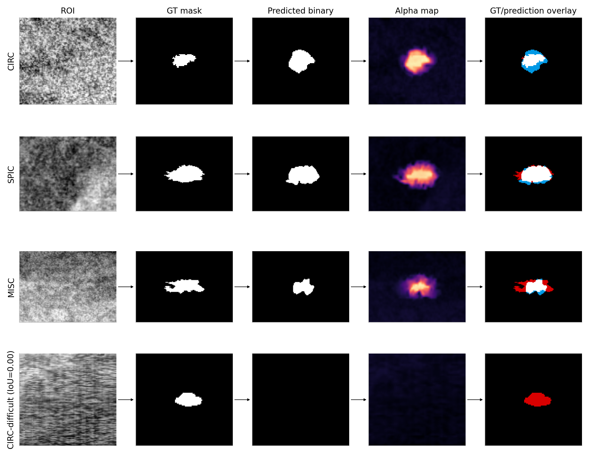

# GrC-Based Image Matting for Mammogram Mass Segmentation

*This project is a part of a Research Internship at LNMIIT Jaipur under the guidance of Dr. Dhruba Jyoti Kalita sir.*

Applying a granular-computing (GrC) image matting technique - originally designed for general foreground/background separation - to mammogram mass segmentation on **MIAS** and **CBIS-DDSM**.

> [!NOTE]
> Base method: Hu, H., Pang, L., Shi, Z. (2016). *Image matting in the perception granular deep learning.* Knowledge-Based Systems, 102, 51–63.

This is an application of the base method - it was not originally designed for medical imaging, so there is no existing published benchmark for this exact technique on either dataset. Both phases are implemented end-to-end and evaluated per class, with the debugging process itself documented as part of the results (see [Notable Finding](#notable-finding-cbis-ddsm) below).

📄 [Full Progress Report (PDF)](docs/Project_report.pdf) — MIAS and CBIS-DDSM phases, detailed methodology, debugging stages, and results.



---

## Table 1 - Summary

| Properties | MIAS | CBIS-DDSM |
|---|---|---|
| Images | 105 | 537 |
| Classes | CIRC / SPIC / MISC / NORM | CIRC / SPIC / MISC |
| Ground truth | Centroid + radius (synthetic circle) | Real radiologist segmentation mask |
| Source image format | PGM (lossless) | JPEG (lossy, Kaggle mirror) |
| K (templates) | 10 | 16 |
| SVM test accuracy | 0.6279 | 0.5593 |

### Architecture (5 layers, shared across both datasets)

```
Layer 1  Multi-scale CLAHE + texture encoding (LIPW/LBPW, 3×3/5×5/7×7)
Layer 2  K-Means-learned texture templates + continuous signed template matching
Layer 3  Normalized local response pooling of Layer 2 template scores
Layer 4  Texture + local intensity features → RBF-SVM → texture-derived mass probability
Layer 5  Hybrid alpha initialization (90% texture / 10% intensity) + Matting-Laplacian refinement
```

Five core modifications are applied on top of the base paper's method: multi-scale CLAHE, multi-scale texture encoding, data-driven K-Means templates, local intensity features, and the hybrid alpha blend.

---

## Per-Class Results

Reported separately per dataset, since CBIS-DDSM has no NORM class and the two datasets don't track identical per-class metrics.

### MIAS

| Class | n | Dice | Sensitivity | Specificity |
|---|---|---|---|---|
| CIRC | 22 | 0.8416 | 0.7464 | 0.9704 |
| MISC | 14 | 0.8181 | 0.7062 | 0.9924 |
| SPIC | 19 | 0.8099 | 0.7019 | 0.9749 |
| NORM | 50 | — | — | 1.0000 |

*HD95/Alpha MAE were tracked per tissue-density (D/F/G) for MIAS, not per class - not shown here since it isn't a direct per-class comparison. NORM has no mass, so Dice/Sensitivity are undefined by construction.*

### CBIS-DDSM

| Class | n | Dice | Sensitivity | Specificity | HD95 | Alpha MAE |
|---|---|---|---|---|---|---|
| CIRC | 177 | 0.6736 | 0.8686 | 0.9853 | 3.2775 | 0.0807 |
| SPIC | 180 | **0.7615** | 0.8347 | 0.9877 | 4.1928 | 0.0855 |
| MISC | 180 | 0.7146 | 0.8455 | 0.9866 | 3.8574 | 0.0836 |

*Curated release contains abnormality cases only - no NORM-equivalent class exists for this phase.*

---

## Table 3 — Ablation Study

| Dataset | Arm | Dice | Sensitivity | Specificity | HD95 | Alpha MAE |
|---|---|---|---|---|---|---|
| MIAS | baseline_3x3_manual | 0.8072 | 0.6941 | 0.9832 | 15.78 | 0.1199 |
| MIAS | mod2_5x5_single_scale | 0.8114 | 0.7029 | 0.9833 | 16.51 | 0.1185 |
| MIAS | mod1234_no_hybrid | 0.8110 | 0.7026 | 0.9833 | 16.49 | 0.1184 |
| MIAS | **full_method** | **0.8142** | 0.7078 | 0.9837 | 16.31 | 0.1517 |
| CBIS-DDSM | **baseline_3x3_manual** | **0.7048** | 0.8834 | 0.9849 | 3.5095 | 0.0301 |
| CBIS-DDSM | mod2_5x5_single_scale | 0.6692 | 0.8401 | 0.9853 | 3.6883 | 0.0306 |
| CBIS-DDSM | mod1234_no_hybrid | 0.6681 | 0.8398 | 0.9853 | 3.6795 | 0.0307 |
| CBIS-DDSM | full_method | 0.6703 | 0.8493 | 0.9847 | 3.6537 | 0.0843 |

The best-performing arm flips between datasets — see [Notable Finding](#notable-finding-cbis-ddsm).

---

## Notable Finding (CBIS-DDSM)

The base method's texture features (LIPW/LBPW, K-Means templates) carry little discriminative signal on CBIS-DDSM at the tested patch scale — confirmed directly:

- Train-only texture response difference, mass vs. background: +0.000001
- Train-only local intensity difference, mass vs. background: +0.0242, indicating a consistent intensity separation

The diagnostic motivated adding a local intensity-derived feature directly into Layer 4's input. In the original architecture, intensity contributes only through the 10% intensity component of the final hybrid alpha initialization in Layer 5.

**Consequence:** the CBIS-DDSM ablation does not show the same pattern as MIAS: the (`baseline 3×3 manual`) configuration achieves the highest Dice (0.7048) among the tested ablation arms, while the full method achieves 0.6703. This is consistent with the weak texture signal observed in the train-only diagnostic.

**Open question, not yet resolved:** whether the weak texture signal is an inherent property of the tissue at this patch scale or is influenced by the characteristics of the CBIS-DDSM image source. Testing against the original DICOM source (via TCIA) would settle this but hasn't been attempted.

---

## Repository Structure

```
GrC-Image_Matting/
├─ docs/
│  ├─ Project_report.pdf
├─ DDSM/
│  ├─ Codebase (CBIS-DDSM)/
│  │  ├─ Notebook_1.ipynb
│  │  ├─ Notebook_2.ipynb
│  │  ├─ Notebook_3.ipynb
│  │  └─ Notebook_4.ipynb
│  └─ Results/
│     ├─ models/
│     ├─ results/
│     └─ config.json
├─ MIAS/
│  ├─ Codebase (MIAS)/
│  │  ├─ Notebook_1.ipynb
│  │  ├─ Notebook_2.ipynb
│  │  └─ Notebook_3.ipynb
│  └─ Results/
│     ├─ models/
│     ├─ results/
│     └─ config.json
├─ Report_figures/
├─ .gitignore
├─ LICENSE
├─ Output_Figures.ipynb
├─ README.md
└─ requirements.txt
```

---

## Key Implementation Notes

- Layer 4 uses an sklearn RBF-SVM in place of the base paper's PSVM, for both datasets.
- CBIS-DDSM's train/test split is grouped by **lesion**, not image - many lesions have both a CC and MLO view, which must stay together to avoid leakage. MIAS has no equivalent multi-view structure.
- All segmentation metrics are computed **per image and per class**, then macro-averaged across images rather than pooled at the pixel level.

---

## Setup

```bash
pip install -r requirements.txt
```

Built for Google Colab with Google Drive mounted as persistent storage - each notebook writes its outputs to Drive and reloads its inputs from Drive at the start, rather than depending on a prior notebook's live session, so any single notebook can be rerun standalone once its dependencies exist on Drive.

**Datasets Used:**
- [MIAS Dataset](https://www.kaggle.com/datasets/kmader/mias-mammography)
- [CBIS-DDSM Dataset](https://www.kaggle.com/datasets/awsaf49/cbis-ddsm-breast-cancer-image-dataset)
  
**Run order:**
- **MIAS** - `01` → `02` → `03`, in order.
- **CBIS-DDSM** - `01` → `02` → `03` → `04` → `05` → `06`, in order.

---

## License

MIT License

## Author

- [Sanjib Das](https://github.com/Sanjib-22)
- [Pragyan Thapa](https://github.com/pragyanthapa)
